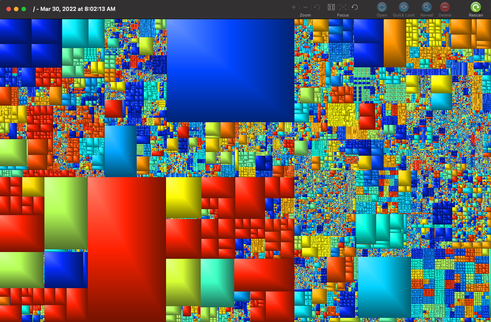

## The Problem: Other Storage Taking up Too Much Space

When your disk is almost full, and you need to "save space by optimizing storage," there is nothing more frustrating than seeing an "Other" category in Mac's Storage Management tool that is hogging the lion's share of your SSD.

Here's the fix:

## Solution: Use GrandPerspective to Identify Which Files/Folders Are Taking up so Much Space

1. Download [Grand Perspective from Sourceforge](https://sourceforge.net/projects/grandperspectiv/) (it’s 4 MB, so you will have to have at least that much storage!).

2. Copy the GrandPerspective app into your `~/Applications/` folder.

You need to open GrandPerspective with permission to read the size of every file in every folder. To open it in this way, do the following:

3. Open Terminal ([how to do this](https://support.apple.com/en-ca/guide/terminal/apd5265185d-f365-44cb-8b09-71a064a42125/mac)).

4. In Terminal paste this command: `security execute-with-privileges /A*/GrandPerspective.app/*/M*/* 2>&-`

You will be prompted to enter your password, to allow GrandPerspective to see every file on your computer. See [Note](#note)

GrandPerspective will show you where and how you are using up your space.

Get this: ***I had 64GB of my 256GB allocated to a Docker image I wasn't even using anymore***.

Deleting it meant I could actually save my dissertation file changes. 🎉 🔥 ⚡️

## Credits

Thanks to [Link Davis](https://discussions.apple.com/profile/Linc+Davis/participation), on this [thread](https://discussions.apple.com/thread/7388279) for putting me on to the GrandPerspective app and the technique of running it with increased permissions.

NOTE: Obviously, if you have government secrets on your computer, you already know that you shouldn’t give some app downloaded off the internet access to all your files. For most of us, however, we’re simply interested in freeing up storage.
