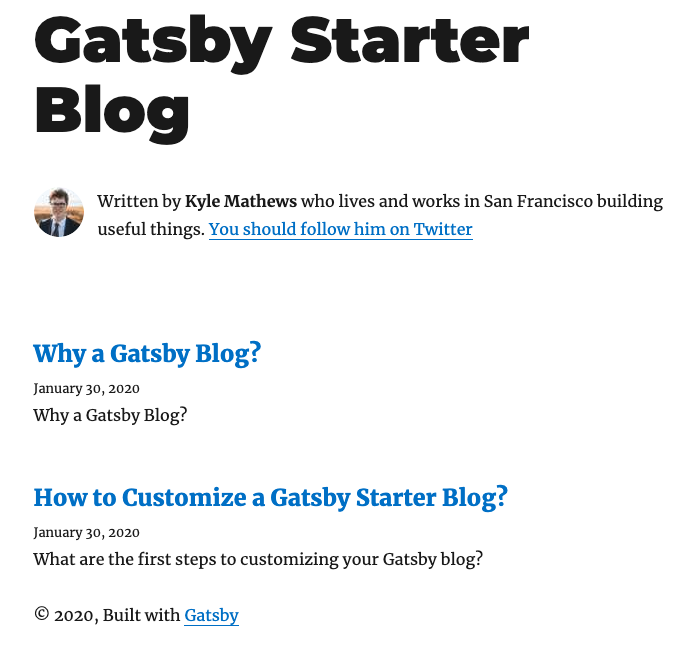
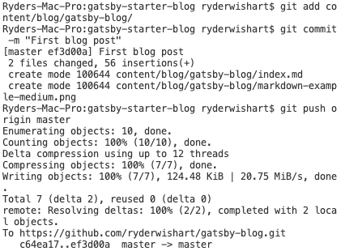

## So I cloned a basic Gatsby blog... Now what?

Once you've clone a Gatsby starter, you can start making posts using Markdown, which is what I did [yesterday](/gatsby-blog). But as soon as you view it, you will see that this new blog is going to require some customization. 

Otherwise it looks like this:



For starters, Kyle Mathews may have made the starter, but this is not his blog. Also, a name like "Gatsby Starter Blog" is not going to cut it in the long run.

Before I describe what's next, I'm assuming you know what Git is (a version-control system for keeping track of code changes). If you don't have git installed on your computer, use a search engine to find a tutorial.

I'm assuming you can commit and push changes from a local directory (a folder on your computer) to a remote repository (a centralized folder on the cloud linked to your local folder).

Here's an example in case you're stuck:

## An example of how to use Git to control updates to your site



First you add the new content.

`git add content/blog/gatsby-blog`

Then you commit those changes. 

`git commit -m "First blog post"`

The `-m` flag means you're adding a message, which comes after, wrapped in quotation marks. 

When you commit a change, that just means it's ready to be sent, or _pushed_ up to the cloud. It hasn't yet been pushed.

So the last step is to push those changes up to the cloud.

When you make a new local blog-post folder, it's just a draft (it's not live yet).

In my case, the path for a new blog post to get from my brain to the internet is like this:

1. I create the draft in my local folder.
2. I view the draft by running `gatsby develop` in my local folder, and viewing it at [http://localhost:8000/](http://localhost:8000/).
3. When I'm happy with the draft, I commit changes and push them up to my GitHub repo (short for repository).
4. My site is served by Netlify, which pays attention to any changes in my Git repo, and then rebuilds and deploys the site with those changes, whenever they are made.

Anyways, now it's time to customize the site.

_As a side note, I need to decide whether I'm going to write from a first or second person perspective._

## Customizing your Gastby blog

There are two key things I want to customize in particular:

- My blog's metadata
- The author bio

### How to customize your Gatsby blog metadata

Since I'm trying to configure my Gatsby blog, the `gatsby-config.js` file seems like a good place to start.

At the top, I see a `siteMetadata` key, and I'd guess that changing those values is a good first step.

```json
siteMetadata: {
    title: `Gatsby Starter Blog`,
    author: `Kyle Mathews`,
    description: `A starter blog demonstrating what Gatsby can do.`,
    siteUrl: `https://gatsby-starter-blog-demo.netlify.com/`,
    social: {
      twitter: `kylemathews`,
    },
  },
```

Of course, thinking about changing the URL and the title of the site forced me to think about getting a domain for the site. Luckily, I wrote my first post yesterday, without worrying about such questions—otherwise I probably would have never gotten around to writing the first post.

I settle on ryder.dev as a domain. It was available, it's super short, it's easy to remember, and costs a fraction of any other domain with only the word 'ryder'.

Now I can set up Google Analytics (data never lies—though people can lie with data, don't get me wrong!).

I can also set up Google Search Console.

If you're wondering why there are two different Google tools for tracking your website (what pages are having what kind of engagement, etc.), it's because Analytics gives you data from the perspective of your website, whereas Search console gives you data from the perspective of Google's index (what queries are people using to find your site, how many clicks you're getting, etc.).

Even though there is an author field in the gatsby-config file, changing this only changes the name field on the site. Our friend Kyle's profile image and bio still shows up.

### How to customize your Gatsby blog authors

Let's fix the author info. This won't take long.

In the `src/components` folder, there's a file called `bio.js`. That sounds like the right place.

Near the bottom of this file, I found some text that describes where Kyle lives and works. I updated that.

When it comes to the profile picture, I noticed that `bio.js` has an image element that starts like this:

```jsx
<Image
    fixed={data.avatar.childImageSharp.fixed}
        ...>
```

What is this `data.avatar`, and how does it find a profile image?

Closer to the top of the file, you can see a "static query":

```graphql
const Bio = () => {
  const data = useStaticQuery(graphql`
    query BioQuery {
      avatar: file(absolutePath: { regex: "/profile-pic.jpg/" }) {
        childImageSharp {
          fixed(width: 50, height: 50) {
            ...GatsbyImageSharpFixed
          }
        }
      }
      site {
        siteMetadata {
          author
          social {
            twitter
          }
        }
      }
    }
  `)
```

You can see that this query involves declaring the `data` constant, which has, thanks to the GraphQL query, an `avatar` property.

The `avatar` property looks for (literally using a regular expression) `regex: "/profile-pic.jpg/"`.

So that's the file I need to replace with my own image.

Under `content/assets` I found that file, and I replaced it with my own image by the same name.

Now the query finds my image, woohoo!

## What am I learning?

In a JAMstack website, all of the little pieces work together in fairly simple ways.

There's a front page, in the pages folder, called `index.js`.

What does this page look like? It uses the `layout.js` component to determine that.

Who is the author of the site? The homepage calls for that information from the `bio.js` component.

I'm sure I'll delve into the way these react components all work and speak to each other more in the future, but for now the big picture architecture seems straightforward enough.
